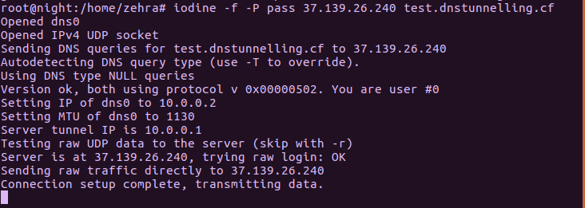
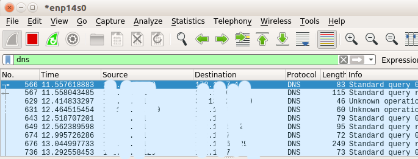
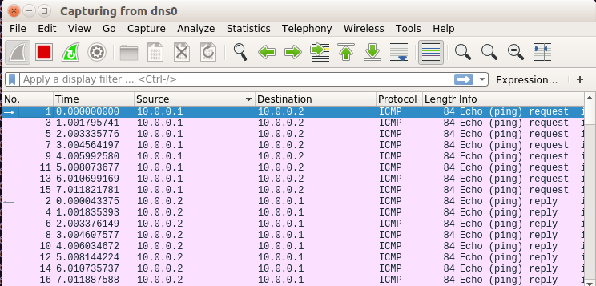

### Iodine Aracı Kullanarak Dns Tünelleme

Iodine aracı kullanarak dns tünelleme nasıl yapılır inceleyelim.
Bize kontrolümüzde olan bir sunucu lazım bunun için ben digitalocean da oluşturduğum sunucuyu kullanacağım. Ve bu sunucuya bağlı bir domain adına ihtiyacımız var. Domain adını ücretsiz olarak edinebileceğiniz bir çok seçenek mevcut. Alan adını alırken dns ayarlarında "use your own DNS" sekmesinden nameserver kısmına digitalocean nameserver adlarını yazıyoruz ve devam ettikten sonra onaylıyoruz.


Digitalocean hesabımızda networking sekmesinden domains sekmesine tıklıyoruz. Oraya aldığımız domain adını ekliyoruz.


Sonrasında hostname verip sunucu ip adresini giriyoruz.


Gerekli olan sunucu dns ayarlaması yapıldıktan sonra aldığımız test.dnstunnelling.cf adresine ping atıp bakabiliriz.


Gelelim dns tünellemede bize eşlik edecek olan iodine aracına. Iodine aracını hem server tarafına hem de client tarafına kuruyoruz. Benim her ikisi de ubuntu işletim sistemi olduğu için direkt aşağıdaki komut ile iki tarafın da kurulumunu gerçekleştirdim.


```
sudo apt-get install iodine
```

Şimdi ***server*** tarafında aşağıdaki komutu yazalım.


```
iodined -f -P password 10.0.0.1 test.dnstunnelling.cf
```

Burada yazan <code>password</code> oluşturulan bağlantıya atanacak olan parola. Client tarafında bağlanılacağı zaman bu parola kullanılır.
10.0.0.1 yerine ise sunucunun dns0 bacağına atamak istediğiniz ip verilir.
test.dnstunnelling.cf yerinede sunucuya eklenen domain adı gelir.


 


***Client*** tarafında ise 


```
iodine -fP password 37.139.26.240 test.dnstunnelling.cf
```

komutu çalıştırılır. (37.139.26.240-->server ip)


 

Dns tünel bağlantısı tamamlandı. İnternete bağlı olduğunuz ağ arayüzünü wireshark ile dinlemeye aldığınızda dns protokollü paketleri görebirsiniz.


 

Aynı zamanda iki tarafta da ping atıp, dns0 arayüzünü dinleyelim.


 


  
 
 


